# Galeria de imagens com React e Django REST Framework

Este projeto contém:

<li align="justify">Uma API de imagens feita com Django REST Framework e integração com JWT e MongoDB</li>
<br>
<li align="justify">Uma interface front-end feita em React que consome esta API</li>
<br>
<p align="justify">A galeria permite envio, obtenção, atualização e deleção de imagens deste sistema, além de também poder links individuais de cada imagem para download.</p>

## Sobre a API

<p align="justify">A API foi toda feita em Django REST Framework, possui proteção de rotas com JWT e possui também persistência de dados em MongoDB. O usuário consegue enviar imagens com título (obrigatório) e descrição (opcional), além de conseguir obter links de cada imagem disponíveis para download.</p>

## Sobre a interface

<p align="justify">A interface foi feita com a biblioteca React e Axios para consumo da API. Com design simples e UX básico, atualmente a interface não possui rotas extras, funcionando inteiramente numa única página HTML.</p>

## Deploy local

<p align="justify">O sistema ainda não possui deploy na nuvem. Portanto, é necessário que seja feito o deploy local do sistema inteiro. Para rodá-lo localmente, siga os seguintes passos:</p>

<ol>
<li align="justify">Clone o repositório remoto numa pasta idealmente vazia de sua preferência.</li>
<p>Exemplo no terminal:</p>

```bash
git clone https://github.com/kauaregisdev/api-imagens.git
```
<br>
<li align="justify">Na raiz de todo o projeto (pasta principal), crie um ambiente virtual e instale as dependências necessárias nele.</li>
<p>Exemplo no terminal:</p>

```bash
python -m venv venv
venv\Scripts\Activate
pip install -r requirements.txt
```
<br>
<li align="justify">Vá para o diretório raiz do app Django e dê deploy local no respectivo servidor.</li>
<p>Exemplo no terminal:</p>

```bash
cd app_imagens
python manage.py runserver
```
Caso o ambiente virtual não esteja ativado, ative-o.
```bash
activate
# resto do código acima...
```
<br>

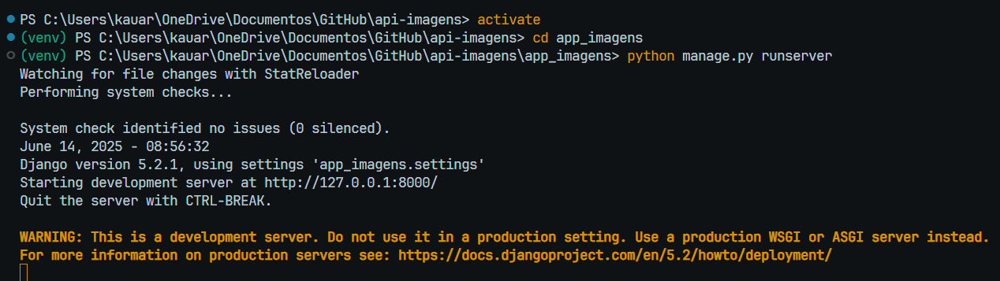
<li align="justify">Em outro terminal, acesse o diretório raiz do app React e dê deploy local no respectivo servidor.</li>
<p>Exemplo no terminal:</p>

```bash
cd galeria-react
npm run dev
```
<br>

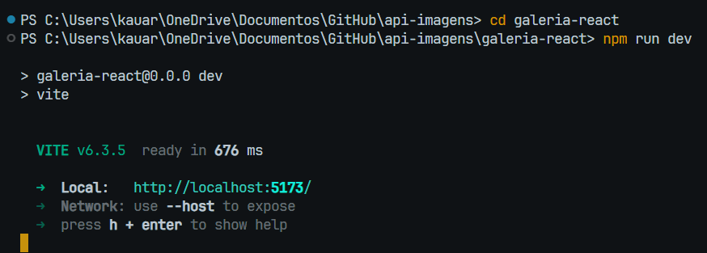
</ol>
<p align="justify">É importante que ambos os apps estejam no ar ao mesmo tempo para que o sistema funcione de forma integral. Porém, caso apenas o back-end esteja rodando, ainda será possível testá-lo por meio de curl ou Postman.</p>

## Comandos no terminal

### Obter token JWT

```bash
curl -X POST http://localhost:8000/token \
  -H "Content-Type: application/json" \
  -d '{"username":"admin","password":"admin123"}'
```

### GET

```bash
curl http://localhost:8000/api/images/ \
  -H "Authorization: Bearer SEU_TOKEN_AQUI"
```

### POST

```bash
curl -X POST http://localhost:8000/api/images/ \
    -H "Authorization: Bearer SEU_TOKEN_AQUI" \
    -F "title=Minha imagem" \
    -F "image=@caminho/para/imagem.jpg"
```

### DELETE

```bash
curl -X DELETE http://localhost:8000/api/images/ID_DA_IMAGEM/ \
    -H "Authorization: Bearer SEU_TOKEN_AQUI"
```

## Explicando o site

<p align="justify">O site é dividido em três páginas: Home, Login e Galeria. A página Galeria é protegida por token, portanto é necessário fazer login para acessar essa aba.</p>

### Homepage

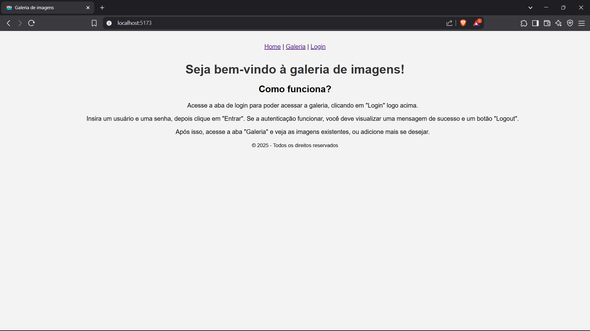
<br>
<p align="justify">Esta é a página inicial do site. Nela, encontra-se uma breve frase de boas-vindas seguida de uma explicação de como utilizar o site.</p>

### Login

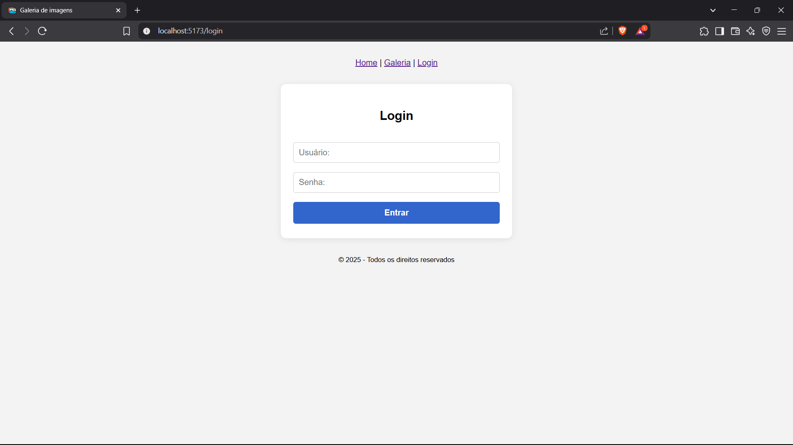
<br>
<p align="justify">Esta é a aba de login do site. Nela, é possível logar com usuário e senha para obter acesso às rotas restritas do site. No caso, a única rota protegida é a rota da Galeria.</p>
<p align="justify">O usuário e a senha padrões são admin e admin123, respectivamente. Insira-os no formulário e clique em "Entrar" para realizar o login corretamente. Caso o login tenha ocorrido normalmente, uma mensagem de sucesso será exibida abaixo do formulário.</p>

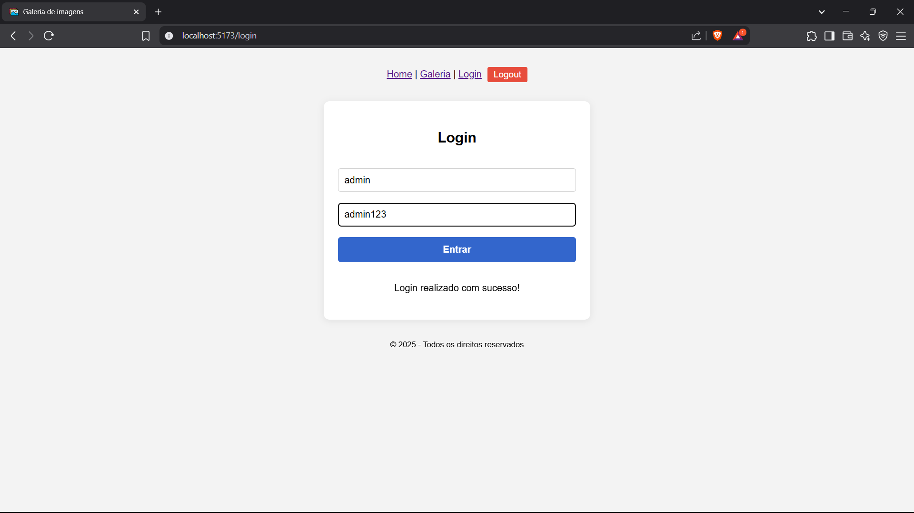
<p align="justify">Caso o usuário aperte em "Logout", o mesmo perde o token JWT e, consequentemente, o acesso à galeria (rota protegida).</p>
<p align="justify">Caso o usuário ou a senha sejam incorretos, o erro será exibido abaixo do formulário.</p>

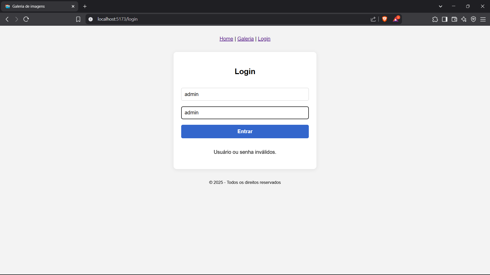

### Galeria

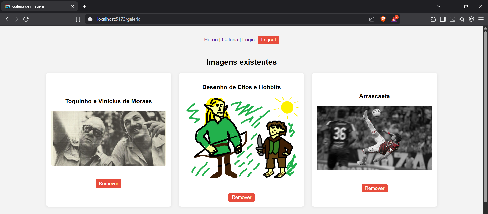
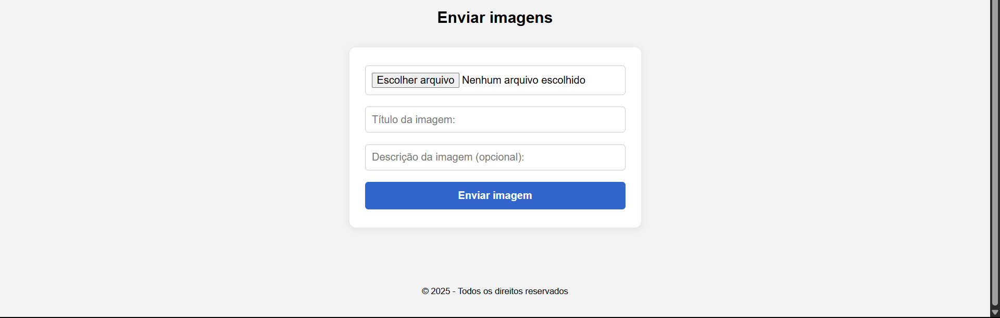
<br>
<p align="justify">Esta é a aba da galeria. Nela, encontra-se as imagens armazenadas no banco de dados e um formulário que permite que novas imagens sejam adicionadas. Para acessar essa aba, é necessário estar autenticado.</p>

## Envio e remoção de imagens

<p align="justify">A seção de galeria permite que o usuário envie ou remova imagens do site. Para explicações aprofundadas, siga as seguintes seções:</p>

### Enviando imagens

<p align="justify">Para enviar imagens, siga os seguintes passos:</p>

<ol>
<li>Na seção "Enviar imagens", clique no botão "Escolher arquivo" para selecionar a imagem que deseja adicionar (.jpg, .jpeg, .png, etc.), e adicione um título para esta imagem.</li><br>

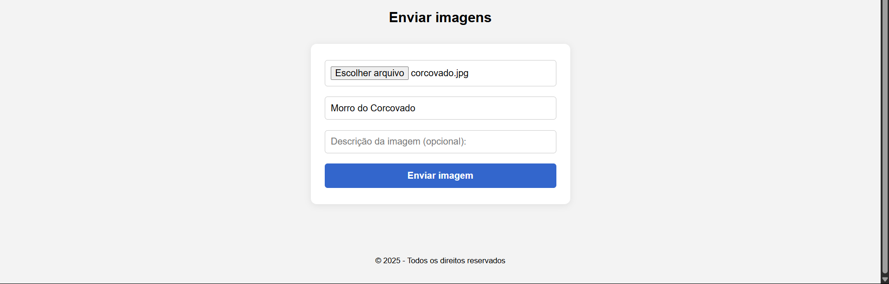
<li>Após isso, clique em "Enviar imagem", ou apenas aperte a tecla Enter. Passados alguns segundos, deverá aparecer um alerta de que a imagem foi enviada com sucesso.</li><br>

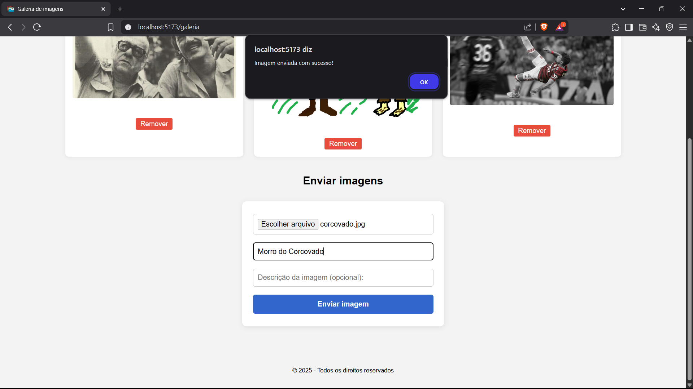
</ol>

<p align="justify">Após o alerta, a página irá recarregar com a imagem recém-adicionada já à mostra na galeria.</p>

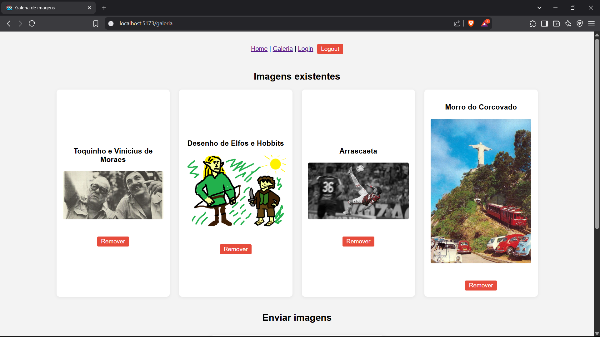

### Removendo imagens

<p>Cada card de imagem possui um botão "Remover" específico que deleta a imagem do banco de dados que alimenta o site. Ao apertar o botão, o usuário recebe uma caixa de confirmação que checa se o usuário está certo de que deseja remover a imagem.</p>

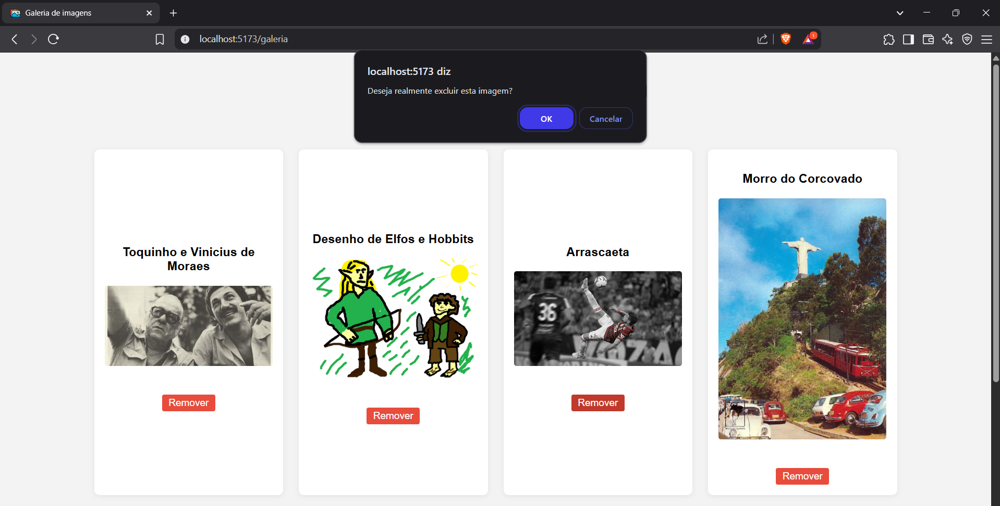
<p align="justify">Ao confirmar, o usuário recebe uma mensagem confirmando a remoção e a página é atualizada sem a imagem recém-removida.</p>

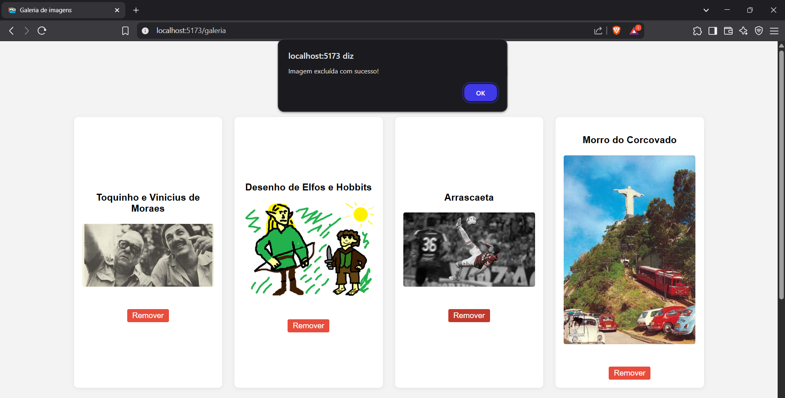
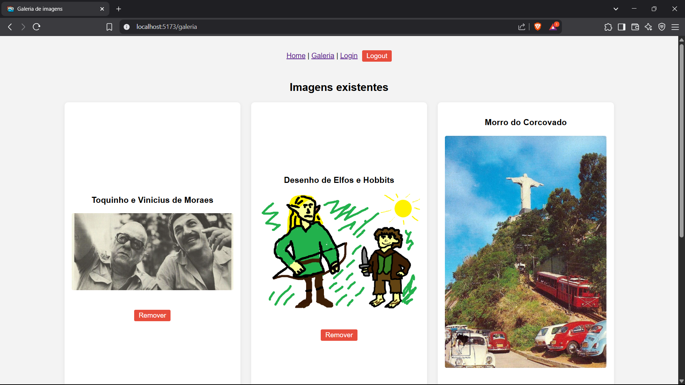